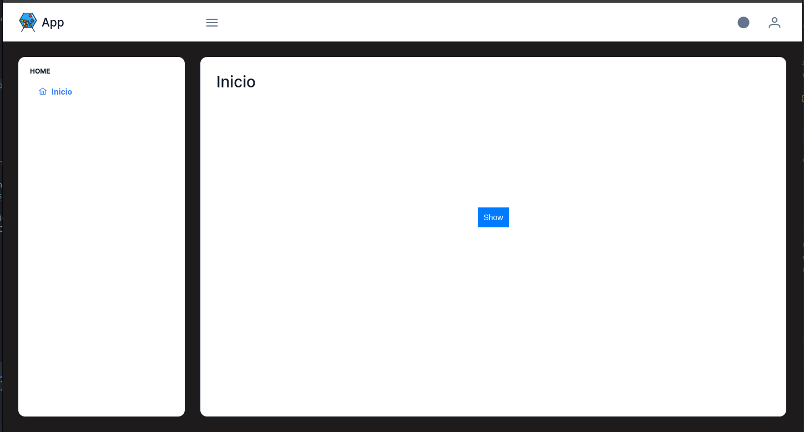
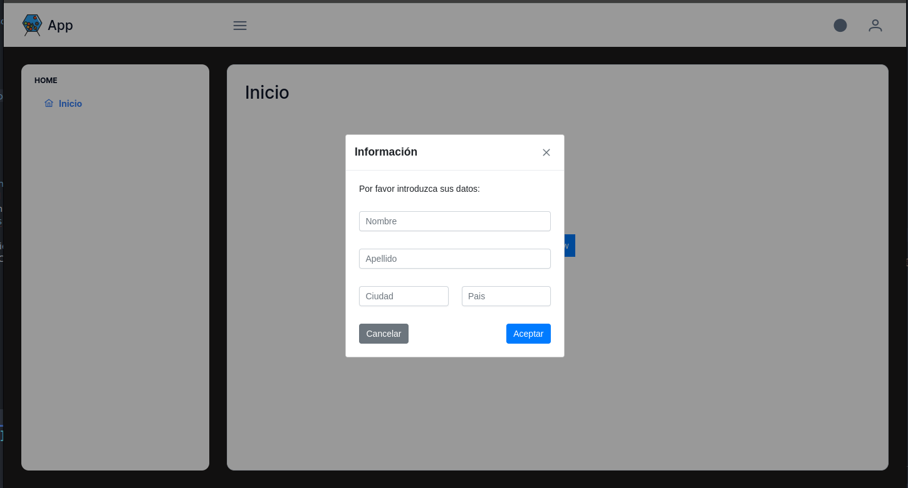
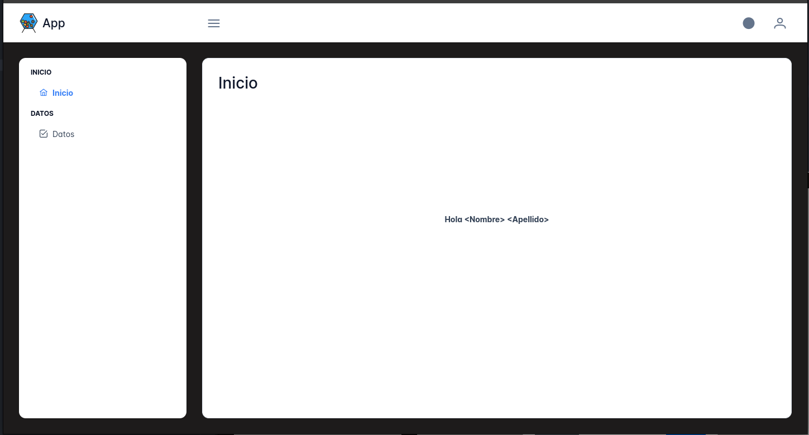

# Desarrollo

## Prerequisitos
* [Docker](https://www.docker.com/)

* #### Codigo fuente
  * [test](https://github.com/banklot/test)

## Instalacion
```
$ cd test
$ docker compose up
```

## Paso 1
Anadir un boton en el centro horizontal y vertical como indica la imagen.



## Paso 2
Al ser presionado, una ventana emergente (Dialog) deberia aparecer.
Atencion a los margenes, espacios y alineacion.


 
## Paso 3
Tomar nombre y apellido del paso anterior y desplegarlos en la pantalla principal.



## Paso 4
Crear una tabla (Datatable) con los datos


## Condiciones
1. Todos los componentes deben ser de [PrimeVue](https://primevue.org/)
2. Usar las clases de [PrimeFlex](https://primeflex.org/) tanto como sea posible.

## Notas 
 Los siguientes parametros seran considerados:
   1. Organizacion y calidad del codigo.
   2. Velocidad de aprendizaje y desarrollo. 