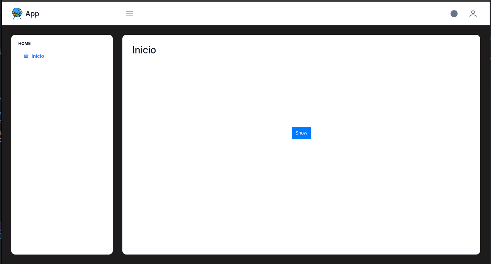
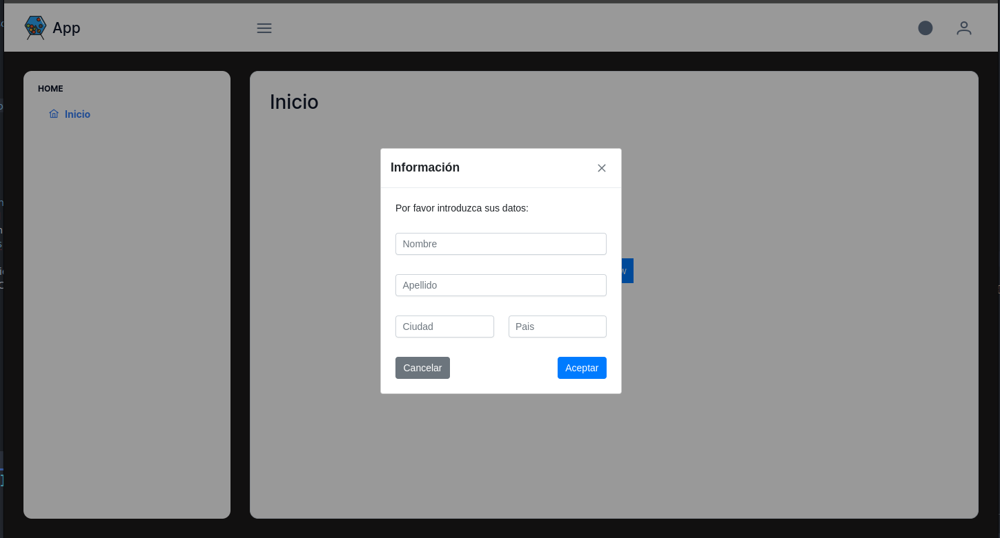
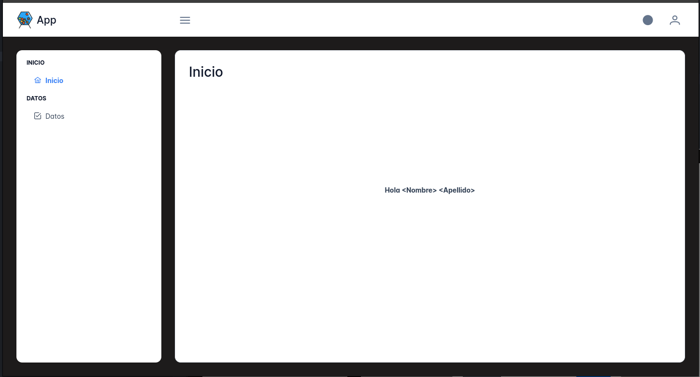
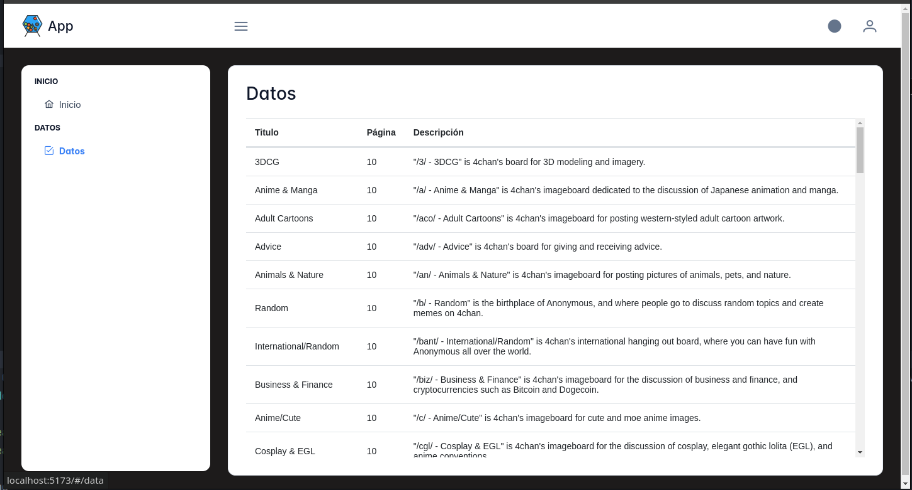

# Desarrollo

## Prerequisitos
* [Docker](https://www.docker.com/)

* #### Código fuente
  * [test](https://github.com/banklot/test)

## Instalación
```
$ git clone https://github.com/banklot/test.git
$ cd test
$ docker compose up
```

## Paso 1
Añadir un botón en el centro horizontal y vertical como indica la imagen.



## Paso 2
Al presionar el botón, una ventana emergente (Dialog) debería aparecer.
Atención a los márgenes, espacios y alineación.


 
## Paso 3
Tomar nombre y apellido del paso anterior y desplegarlos en la pantalla principal.



## Paso 4
Crear una tabla (Datatable) con los datos de la funcion apiService.loadData()



## Condiciones
1. Todos los componentes deben ser de [PrimeVue](https://primevue.org/)
2. Usar las clases de [PrimeFlex](https://primeflex.org/) tanto como sea posible.

## Notas 
 Los siguientes parámetros serán considerados:
   1. Organización y calidad del código.
   2. Velocidad de aprendizaje y desarrollo. 
